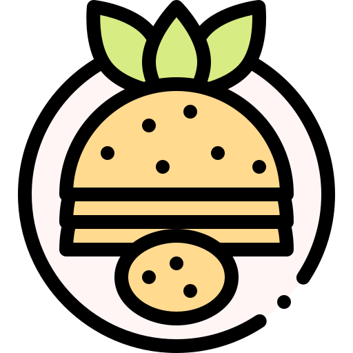

# DevDishes 🍳

**Find your next favorite meal with DevDishes, a beautiful and intuitive recipe discovery web application.**

DevDishes is a modern, responsive web application that helps you discover exciting new recipes based on the ingredients you have on hand. With a sleek, dynamic interface featuring animated gradients and glassmorphism effects, finding your next culinary creation has never been more enjoyable.


<p align="center">
  
</p>

<p align="center">
  
</p>


## ✨ Key Features

*   **Ingredient-Based Search**: Simply type in the ingredients you have, and get a list of matching recipes.
*   **Interactive Recipe Cards**: Browse recipes in a beautiful grid layout with smooth hover effects and quick-view buttons.
*   **Detailed Recipe Modal**: Click on any recipe to view a detailed modal with:
    *   Full ingredient list with quantities.
    *   Step-by-step instructions.
    *   Cuisine type, prep time, and other stats.
    *   A direct link to the original recipe source.
*   **Fully Responsive Design**: A mobile-first design that looks and works great on all devices, from small phones to large desktops.
*   **Stunning UI/UX**:
    *   Beautiful animated gradient background.
    *   Modern "glassmorphism" elements for the search bar and footer.
    *   Smooth, meaningful transitions and animations.
*   **Dynamic User Feedback**:
    *   Loading spinner while fetching recipes.
    *   Helpful welcome and "no results" messages.
*   **Accessibility in Mind**:
    *   Respects user's motion preferences with `@media (prefers-reduced-motion)`.
    *   Basic dark mode support via `@media (prefers-color-scheme: dark)`.

---

## 🛠️ Tech Stack

This project is built with a focus on modern front-end technologies.

*   **HTML5**: Semantic markup for structure and accessibility.
*   **CSS3**: For all styling, layout, and animations.
    *   **CSS Custom Properties (Variables)**: For a maintainable and themeable design system.
    *   **Flexbox & CSS Grid**: For robust and responsive layouts.
    *   **Animations & Transitions**: For a dynamic and engaging user experience.
    *   **`backdrop-filter`**: To create the glassmorphism effect.
*   **JavaScript (ES6+)**: (Assumed) For DOM manipulation, handling user events, fetching data from a recipe API, and rendering content dynamically.

---

## 🚀 Getting Started

To get a local copy up and running, follow these simple steps.

### Prerequisites

You just need a modern web browser that supports HTML5, CSS3, and JavaScript.

### Installation

1.  **Clone the repository**
    ```sh
    git clone https://github.com/your-username/DevDishes.git
    ```
2.  **Navigate to the project directory**
    ```sh
    cd DevDishes
    ```
3.  **Open the application**
    Simply open the `index.html` file in your web browser.

    > **Note:** If the project uses an API that requires a key or has CORS restrictions, you might need to run it on a local server. A simple way to do this is with the Live Server extension for VS Code.

---

## 📖 How to Use

1.  Upon opening the app, you'll see a search bar.
2.  Type the ingredients you have available, separated by commas (e.g., `chicken, potatoes, carrots`).
3.  Click the **"Search Recipes"** button.
4.  Browse the recipe cards that appear in the results grid.
5.  Hover over a card and click **"View Recipe"** to open a detailed modal.
6.  In the modal, you can review the ingredients and instructions.
7.  Click the **"View Full Recipe"** button to visit the original source website.

---

## 📂 Project Structure

The project follows a standard structure for a simple front-end application:

```
DevDishes/
├── 📄 index.html       # The main HTML file
├── 🎨 style.css        # All styles for the application
└── ⚙️ script.js        # (Assumed) JavaScript for application logic
└── 🖼️ images/          # For images like the logo
```

---

## 🤝 Contributing

Contributions are what make the open-source community such an amazing place to learn, inspire, and create. Any contributions you make are **greatly appreciated**.

1.  Fork the Project
2.  Create your Feature Branch (`git checkout -b feature/AmazingFeature`)
3.  Commit your Changes (`git commit -m 'Add some AmazingFeature'`)
4.  Push to the Branch (`git push origin feature/AmazingFeature`)
5.  Open a Pull Request

---

## 📄 License

Distributed under the MIT License. See `LICENSE` file for more information.


Made with ❤️ by Deepak Tyagi